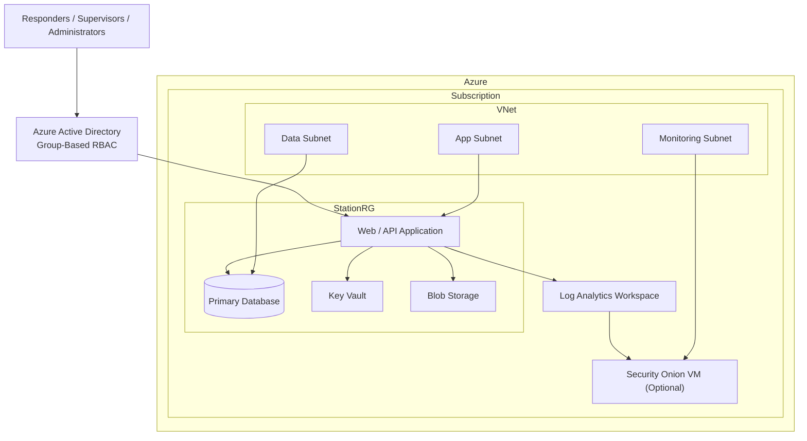

# EMS ReadyKit – Architecture Overview

This document describes the high‑level architecture for **EMS ReadyKit**, a non‑production,
cloud‑native inventory and vehicle readiness platform.

The design emphasizes:
- Simplicity
- Security by default
- Centralized observability
- Cost discipline
- Clear operational boundaries

---

## High‑Level Architecture

---

## Networking Notes

The default SKU is **F1 (free tier)**, which does not support VNet integration.
On F1, the App Service reaches Azure SQL over the public internet via an
Azure-services firewall rule. The VNet, subnets, and private endpoint are
provisioned and ready — upgrading to B1+ and enabling VNet integration requires
only a SKU change and adding a Private DNS Zone for `privatelink.database.windows.net`.

See [ADR-001](../adr/ADR-001-Architecture.md) for the full architecture rationale
and [ADR-004](../adr/ADR-004-Terraform-Module-Structure.md) for the IaC structure.
