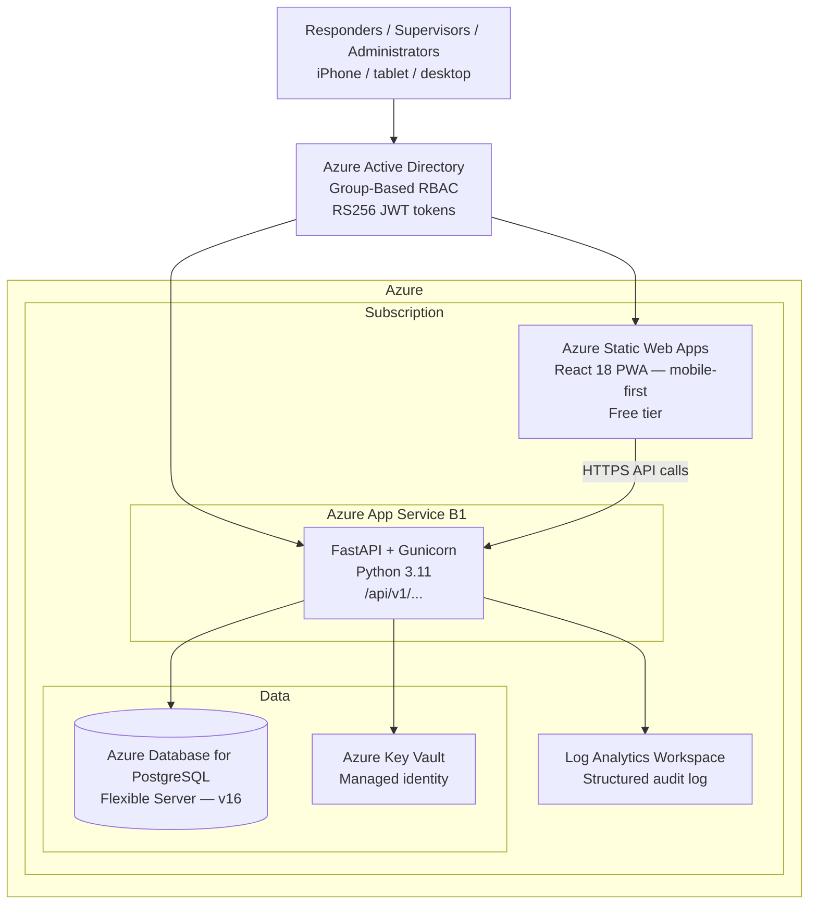

# EMS ReadyKit — Architecture Overview

This document describes the high-level architecture for **EMS ReadyKit**, a
cloud-native inventory and vehicle readiness platform serving Newberg Township
EMS, Cass County, Michigan.

The design emphasizes:
- Simplicity — single region, single datastore, single application
- Security by default — Azure AD RBAC, managed identity, Key Vault, no secrets in code
- Centralized observability — structured logging, Log Analytics, audit trail
- Cost discipline — B1 App Service, free Static Web Apps tier, budget alerts
- Clear operational boundaries — station membership enforced at application layer

---

## High-Level Architecture



---

## Component Responsibilities

| Component | Purpose |
|-----------|---------|
| **Azure Active Directory** | Identity provider; issues RS256 JWT tokens; three app roles: Administrator, Supervisor, Responder |
| **Azure Static Web Apps** | Hosts the React PWA; handles SWA routing and security headers; free tier |
| **Azure App Service B1** | Runs FastAPI + Gunicorn; 18 Alembic migrations auto-apply on startup; managed identity for Key Vault |
| **Azure Database for PostgreSQL** | Primary datastore; Alembic schema management; private connection from App Service |
| **Azure Key Vault** | Stores database credentials and application secrets; accessed via managed identity |
| **Log Analytics Workspace** | Receives structured application logs and audit events; 30-day retention |

---

## Authentication and Authorization Flow

```
User opens app
    → MSAL authenticates against Azure AD
    → Azure AD issues RS256 JWT with role claim (Administrator/Supervisor/Responder)
    → React app stores token; Axios attaches it as Bearer on every API call
    → FastAPI validates JWT signature against Azure AD JWKS endpoint
    → require_role() dependency checks role claim
    → require_station_membership() checks StationMember table for station-scoped endpoints
    → Handler executes; performed_by bound from JWT (never client-supplied)
    → write_audit_event() logs actor + action + entity to AuditEvent table
```

---

## Networking Notes

The App Service runs on **B1**, which supports VNet integration. The VNet,
subnets, and private endpoint infrastructure are provisioned via Terraform and
ready to activate. Full VNet integration (private PostgreSQL connection, no
public database endpoint) requires enabling the VNet integration setting on the
App Service and adding a Private DNS Zone for
`privatelink.postgres.database.azure.com`.

The current deployment uses an Azure-services firewall rule on PostgreSQL
(only Azure-originating traffic permitted) as an interim measure.

See [ADR-001](adr/ADR-001-Architecture.md) for the full architecture rationale
and [ADR-004](adr/ADR-004-Terraform-Module-Structure.md) for the IaC structure.

---

## Key Architectural Decisions

| Decision | Rationale |
|----------|-----------|
| Single region | Domain size and volunteer crew footprint do not justify geo-redundancy cost |
| Single datastore (PostgreSQL) | No polyglot persistence needed; SQLAlchemy + Alembic handle the schema cleanly |
| React PWA (not native app) | No app store distribution required; PWA installable on iOS and Android; single codebase |
| Azure Static Web Apps | Free tier sufficient; built-in global CDN; SWA routing handles PWA deep links |
| Station membership at application layer | Azure AD groups handle role; application layer handles which station each user belongs to — more flexible than AD group-per-station |
| Audit events in PostgreSQL | Co-located with operational data; queryable via SQL; no additional service required |
| B1 App Service | Always-on (no cold starts); VNet-capable; single Terraform variable to scale |

For full decision records, see [docs/adr/](adr/).
